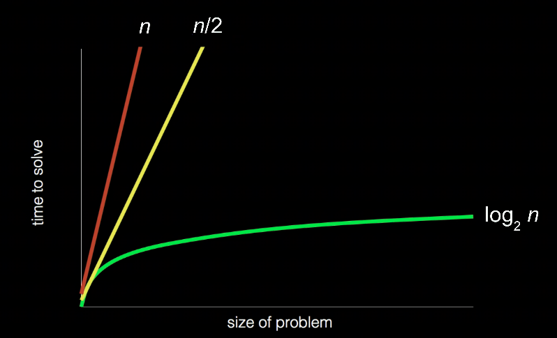

# Computer Science

## **키워드**

- Computer Science
- 문제 해결
- base-1
- base-2
- binary
- binary digit
- bit
- pattern
- 10진법 (decimal)
- byte
- ASCII
- 유니코드 (Unicode)
- RGB
- 알고리즘 (Algorithm)
- pseudocode
- Artificial Intelligence

---

## 1. **비트와 패턴**
- **비트 (Bit)**: 컴퓨터는 정보를 표현하기 위해 0과 1 두 비트만 사용.
  - 비유: 전구 (꺼짐 = `0`, 켜짐 = `1`).
- **트랜지스터**: PC, 스마트폰 등의 기기에 수백만 개 포함된 작은 스위치.
  - 스위치를 켜거나 꺼서 정보를 저장 (`0` = 꺼짐, `1` = 켜짐).
- **10진법 (Decimal)**: 인간이 사용하는 숫자 체계.
  - 예: `123` = `100 * 1 + 10 * 2 + 1 * 3` = `100 + 20 + 3`.
  - 각 자리의 가중치: 왼쪽 자리가 오른쪽보다 큰 가중치 (10의 거듭제곱: `10²`, `10¹`, `10⁰`).
  - 각 자리는 0~9 (10가지 가능성).
- **2진법 (Binary)**: 컴퓨터가 사용하는 숫자 체계.
  - 가중치: `2²`, `2¹`, `2⁰` (예: `111` = `4 + 2 + 1` = 7).
  - 예:
    - `000` = 0 (모두 꺼짐).
    - `001` = 1 (맨 오른쪽만 켜짐).
    - `111` = 7 (모두 켜짐).

---

## 2. **더 큰 수 표현: 바이트 (Byte)**
- **비트 추가**: 1비트 추가 시 `2³`, `2²`, `2¹`, `2⁰` (예: `1000` = 8).
- **바이트 (Byte)**: 8비트로 구성.
  - 표현 가능 범위: `128`, `64`, `32`, `16`, `8`, `4`, `2`, `1` → 0~255 (총 256가지).
  - 컴퓨터에서 일반적으로 사용하는 기본 단위.

---

## 3. **문자 표현: ASCII**
- **ASCII**: 알파벳과 기호를 숫자로 매핑.
  - 예: 대문자 `A` = `01000001` (10진수 65), 소문자 `a` = 97.
  - 3바이트 예: `72 73 33` = `H I !`.
- **다른 언어**: 영어 외 언어는 8비트 이상 (16, 32, 64비트 등) 사용 가능.

---

## 4. **유니코드 (Unicode)**
- **목적**: ASCII를 확장, 모든 인간 언어(과거, 현재, 미래) 및 그림 문자, 이모지 등을 디지털로 표현.
  - ASCII와 하위 호환성 유지.
- **예**: 😂 이모지는 `4036991106`으로 표현.
- **특징**: 사람, 장소, 사물, 감정 등을 포함한 광범위한 표현 가능.

---

## 5. **RGB**
- **픽셀**: 디바이스의 화면은 픽셀로 구성.
  - 각 픽셀은 3바이트(24비트)로 색상 표현.
  - 예: `72 73 33` → 노란색 음영.
- **구성**: 빨강(R), 초록(G), 파랑(B) 값으로 색상 조합.

---

## 6. **알고리즘 (Algorithm)**
- **정의**: 문제를 해결하기 위한 단계별 절차.
- **예: 전화번호부에서 John Harvard 찾기**:
  - 최악: 1000장 모두 확인.
  - 효율적: 이진 탐색 (반씩 나누기).
    - 책을 반으로 나눠 `J`가 있는 쪽 선택.
    - 다시 반으로 나눠 반복.
    - 결과: 찾거나, 없음을 확인.
  - 이미지 참조: 
    -  (이진 탐색 과정 시각화)

---

## 7. **의사코드 (Pseudocode)**
- **정의**: 알고리즘을 자연어로 표현한 코드.
- **예: 전화번호부 탐색**:
  ```text
  1 Pick up phone book
  2 Open to middle of phone book
  3 Look at page
  4 If person is on page
  5     Call person
  6 Else if person is earlier in book
  7     Open to middle of left half of book
  8     Go back to line 3
  9 Else if person is later in book
  10    Open to middle of right half of book
  11    Go back to line 3
  12 Else
  13    Quit
  ```

---

## 8. **프로그래밍 용어**
- **Functions**: 함수.
  - **Arguments**: 함수에 전달되는 입력.
  - **Return value**: 함수가 반환하는 값.
  - **Variables**: 데이터를 저장하는 변수.
- **Conditions**: 조건문 (`if`, `else` 등).
- **Boolean expressions**: 참/거짓을 반환하는 표현식.
- **Loops**: 반복문 (`while`, `for` 등).
- 기타: 추가적인 프로그래밍 개념.

---

## 9. **인공지능 (Artificial Intelligence)**
- **챗봇 예제**:
  - 모든 경우의 수를 코드로 작성하는 것은 불가능:
    ```text
    If student says hello
        Say hello
    Else if student says goodbye
        Say goodbye
    Else if student asks how you are
        Say well
    Else if student asks why 111 in binary is 7 in decimal
        ...
    ```
- **해결책**: AI 학습.
  - **신경망 (Neural Network)**: 생물학에서 영감 받은 구조.
  - 동작: 통계와 확률 사용 → 질문에 대해 가장 가능성 높은 답변 출력.
  - 목표: AI가 스스로 질문에 대한 적절한 답변 학습.
